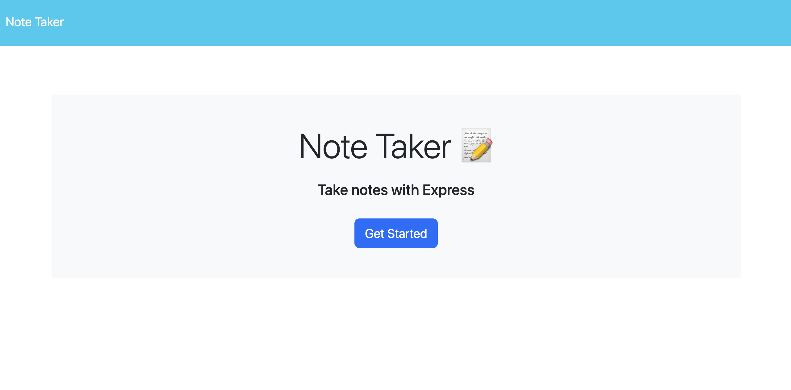
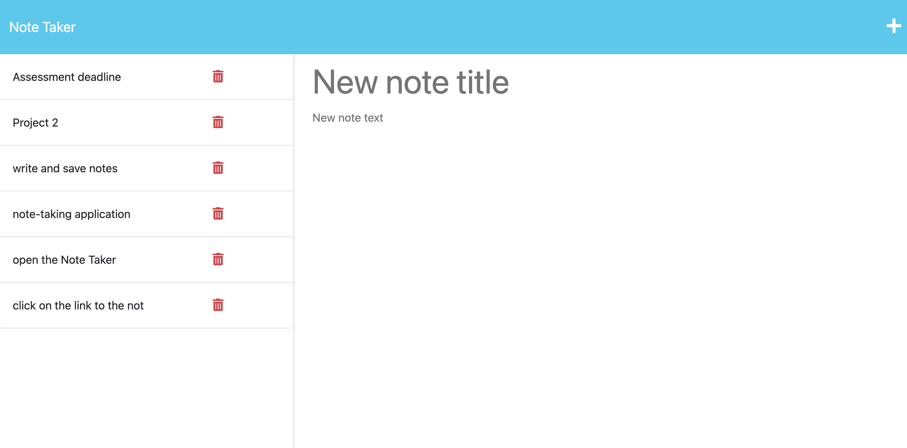
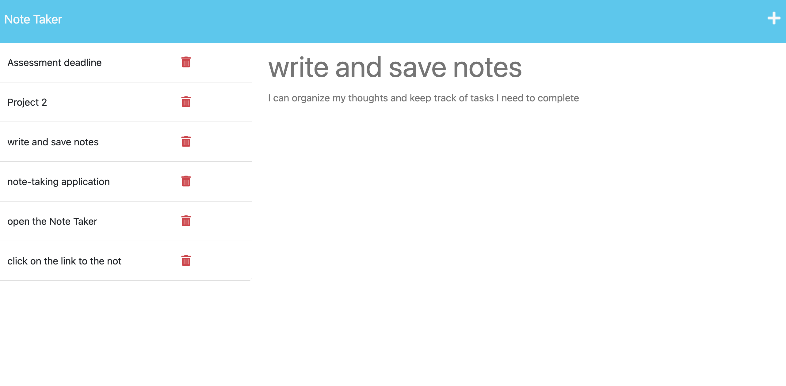
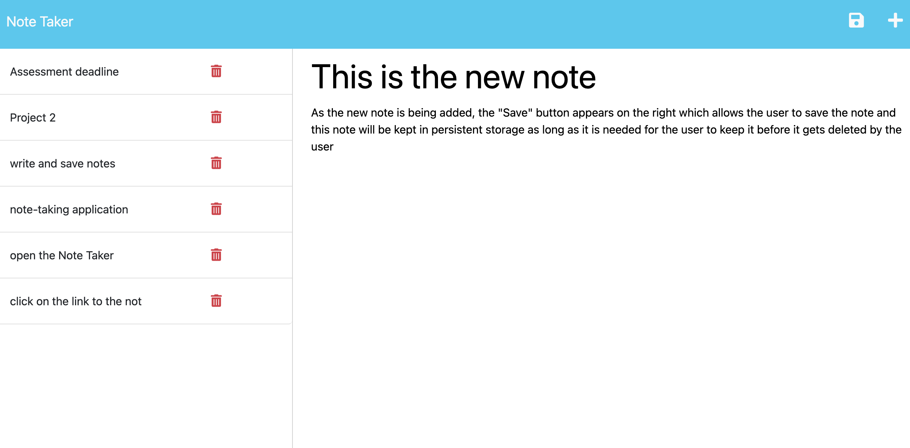

# note-taker
An application Note Taker can be used to write and save notes. This application uses Express.js back end and saves and retrieves note data from a JSON file.

## Description

This application is client server architecture using JavaScript, HTML and CSS on the front end and Express JS node server at the backend with the middleware functions and persistent memory storage deployed in the cloud and accessed via live URL. Nothing needs to be installed locally the application runs from the browser URL and uses persistent storage to keep the notes of the user in the memory. The notes will be loaded once the application is started in the browser and updated by the user as need be. The notes can be accessed from the different devices using the same URL.

## Table of Contents

  [Title](#title)

  [Description](#description)

  [Installation](#installation)

  [Usage](#usage)

  [License](#license)

  [Contributing](#contributing)

  [Questions](#questions)

## Installation

Launch the application using the following URL from the browser of the device connected to Internet: 

https://note-taker-vl1.herokuapp.com/

## Usage

Once the application is launched, the following screen should appear:

Once the user clicks on "Get Started" button, the screen with the notes saved in the memory will render, attached screenshot shows on how this screen could look like:

When the user clicks on one of the saved notes at the left pane, the selected note is being displayed on the screen in a read-only mode:

When the user clicks on the "Plus" button on the upper right side, the new note is being added and once both title and the text of that note is populated, the "Save" button appears which allows to save the note and it is then being displayed on the left pane of the saved notes:

When the user clicks the red "Delete" button on the saved note, the note gets permanently deleted from the memory, the note list is updated with the deleted note removed from it.

## Credits

N/A for this applicaton

## License

MIT License

Copyright (c) 2022 vasilyl1

Permission is hereby granted, free of charge, to any person obtaining a copy of this software and associated documentation files (the "Software"), to deal in the Software without restriction, including without limitation the rights to use, copy, modify, merge, publish, distribute, sublicense, and/or sell copies of the Software, and to permit persons to whom the Software is furnished to do so, subject to the following conditions:

The above copyright notice and this permission notice shall be included in all copies or substantial portions of the Software.

THE SOFTWARE IS PROVIDED "AS IS", WITHOUT WARRANTY OF ANY KIND, EXPRESS OR IMPLIED, INCLUDING BUT NOT LIMITED TO THE WARRANTIES OF MERCHANTABILITY, FITNESS FOR A PARTICULAR PURPOSE AND NONINFRINGEMENT. IN NO EVENT SHALL THE AUTHORS OR COPYRIGHT HOLDERS BE LIABLE FOR ANY CLAIM, DAMAGES OR OTHER LIABILITY, WHETHER IN AN ACTION OF CONTRACT, TORT OR OTHERWISE, ARISING FROM, OUT OF OR IN CONNECTION WITH THE SOFTWARE OR THE USE OR OTHER DEALINGS IN THE SOFTWARE.

## Contributing

vl1
  
## Questions

My GitHub name is vl1. Most of the answers to the questions can be found there, here is the link to my profile at GitHub:

https://github.com/vl1

For additional questions please e-mail to likhovaido@gmail.com

Thank you for your interest in this app.
